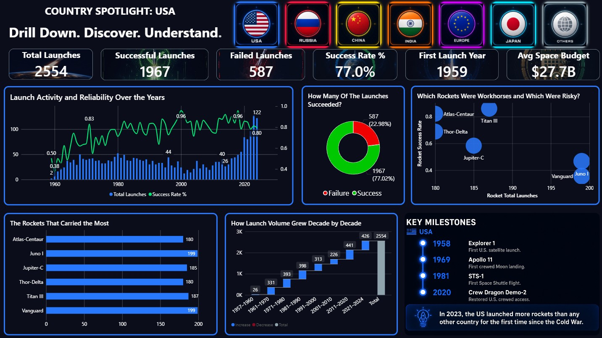
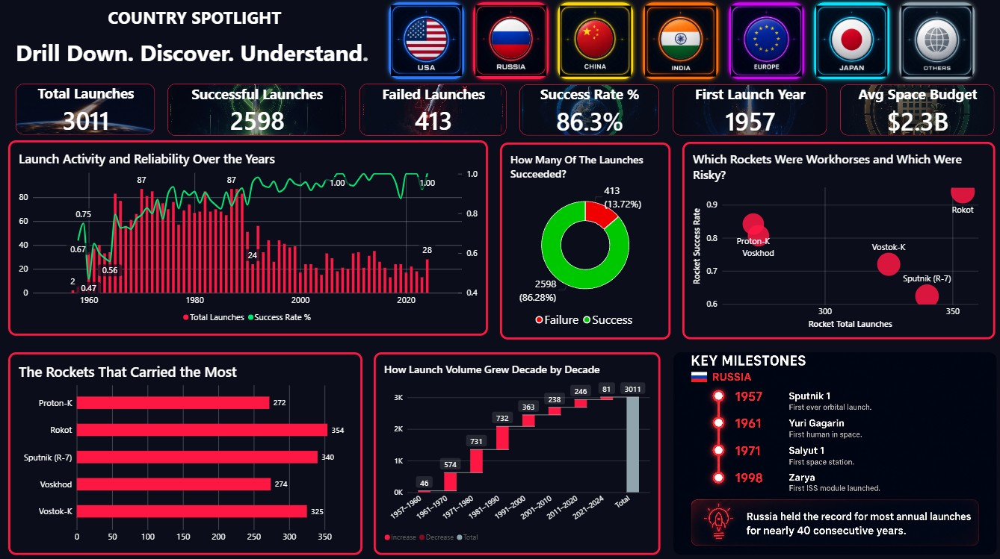
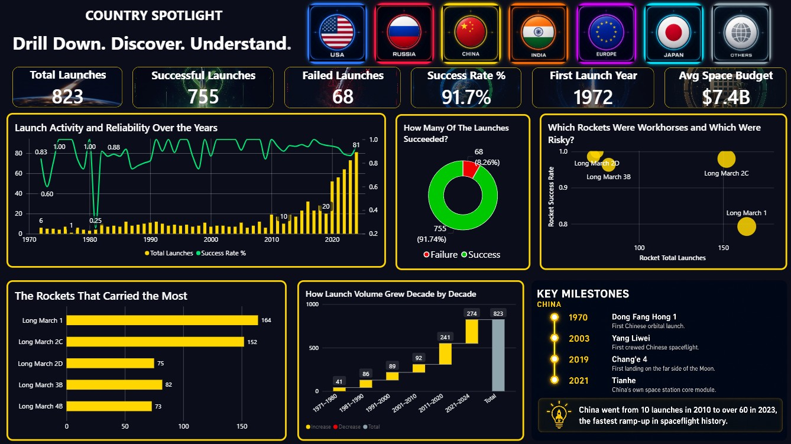
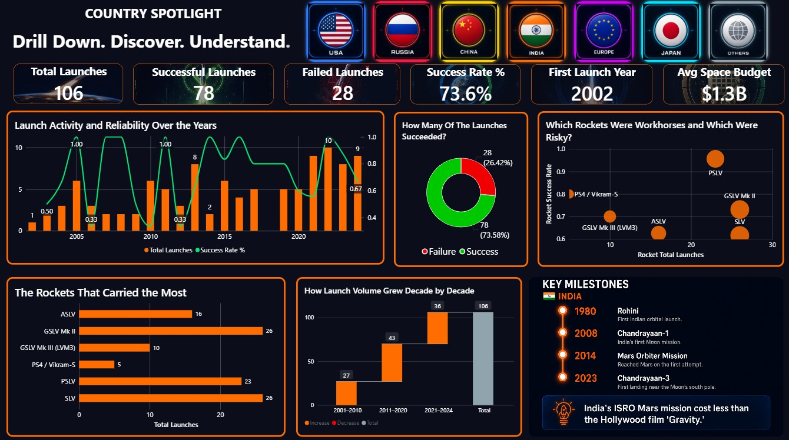
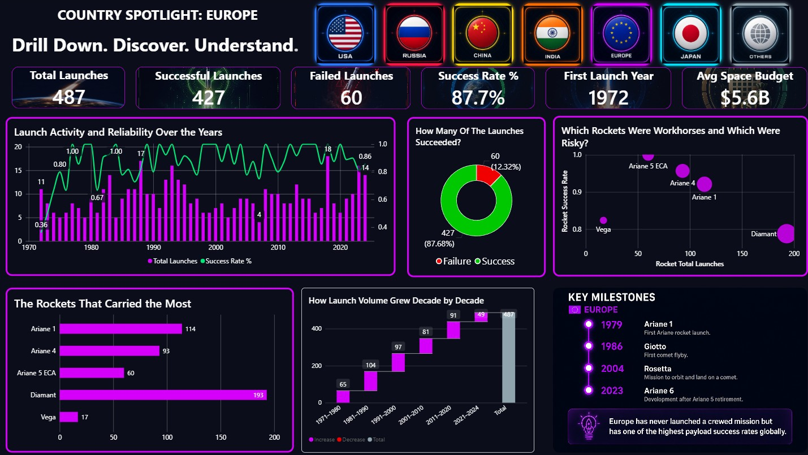
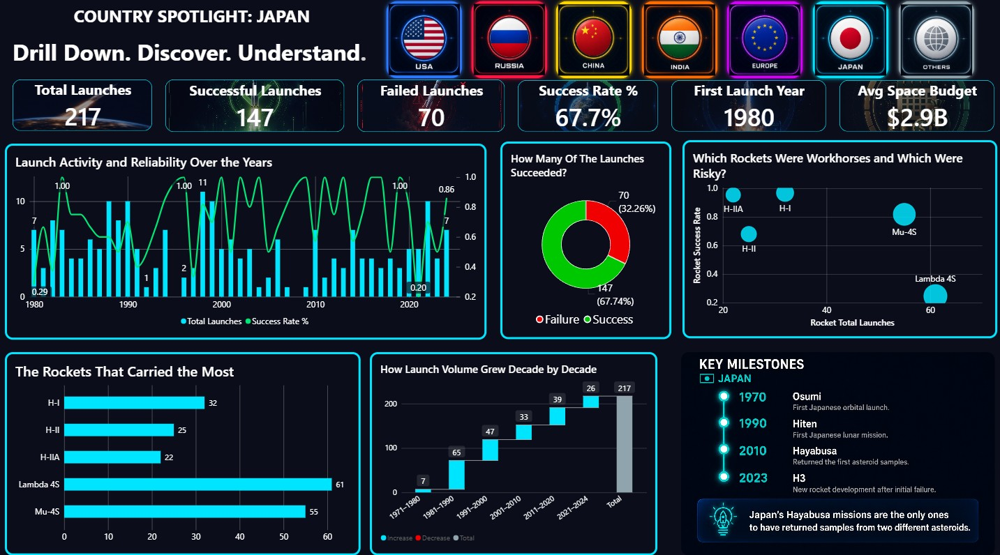
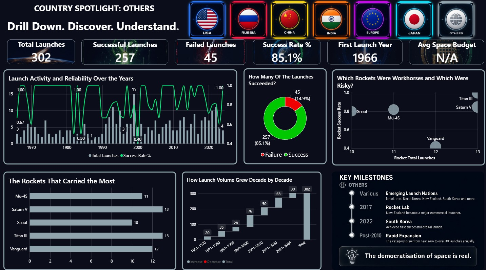

# The New Space Race
### 70 Years of Orbital Launches — A Power BI Dashboard


---

## About

I came across a space launches dataset while watching a YouTube video about a Power BI competition and got curious enough to explore it myself. No brief, no deadline, no portfolio plan. I just wanted to see whether the story we usually hear about the space race actually matched the numbers.

This is a 3-page interactive Power BI dashboard covering every orbital launch from 1957 to 2024. 7,500 launches across 7 countries and regions, spanning three distinct eras of spaceflight.

---

## The Story

The dashboard is built around a narrative arc across three eras:

- **Act 1: Cold War Era (1957 to 1991):** A bipolar space race. USA and USSR compete for supremacy. Ideology, prestige, and firsts define every launch.
- **Act 2: Quiet Middle (1992 to 2010):** The race cools. Collaboration emerges. Fewer dramatic shifts, more players, steady and methodical progress.
- **Act 3: New Eruption (2011 to Present):** A new multipolar race. China rises fast, India enters seriously, and the US surges again.

---

## What the Data Actually Said

### The headline findings

- Russia launched nearly twice as many rockets as the USA during the Cold War (2,107 vs 1,185). And still lost.
- We are now in the busiest period of spaceflight ever. More rockets are being launched than at any other point in history, but because the volume is so high, the absolute number of failures has also gone up.
- China went from 10 launches in 2010 to more than 80 in 2023, the sharpest ramp-up in spaceflight history.
- The US launched 867 times in the New Eruption era alone, more than China and Russia combined in that same period.
- India reached Mars on its first attempt with one of the smallest space budgets of any spacefaring nation.

### Findings by country

**USA**
- 2,554 total launches, 77.0% success rate
- The lowest success rate of any Western spacefaring nation, entirely because of Cold War era desperation launches in the late 1950s and 1960s
- Spent an average of $27.7B per year on space, the highest of any nation
- Despite spending the most and launching the most, the success rate trails Russia, China, and Europe
- The waterfall chart shows steady decade-on-decade growth with no single period of decline

**Russia**
- 3,011 total launches, 86.3% success rate, first launch in 1957
- The most launches of any country in history
- Operated on an average budget of just $2.3B per year, far less than the US, yet launched at higher volumes for decades
- Peak was 87 launches in a single year during the Cold War
- Post-Soviet decline is clearly visible: from over 80 launches per year in the 1980s to 28 in the most recent years
- The Sputnik (R-7) rocket family has over 340 launches but a success rate of only around 63%, reflecting its early experimental years

**China**
- 823 total launches, 91.7% success rate, first launch in 1972
- The highest success rate of any major spacefaring nation
- Nearly invisible until 2010, then grew faster than any country in history
- 274 launches in the 2021 to 2024 period alone, almost a third of its entire history in just 4 years
- Long March 1 is the most used Chinese rocket with 164 launches
- The Long March family dominates with consistently high success rates across all variants

**India**
- 106 total launches, 73.6% success rate, first launch in 2002
- The smallest launch count of any named country in the dashboard
- Average space budget of just $1.3B per year, the lowest of all named nations
- Despite this, ISRO reached Mars on the first attempt, landed near the Moon's south pole in 2023, and operates one of the most reliable rockets in the world (PSLV has a near-perfect record)
- The overall 73.6% success rate is dragged down by early SLV and ASLV failures in the 1980s and 1990s
- Launch volume has been accelerating sharply since 2020

**Europe**
- 487 total launches, 87.7% success rate, first launch in 1972
- Has never launched a crewed mission, yet maintains one of the highest success rates globally
- Diamant is the most used European rocket with 193 launches, largely overlooked in mainstream space discussions
- Ariane 1 alone accounts for 114 launches
- The Ariane family has been the backbone of European access to space for over 40 years
- Budget averaged $5.6B per year across all ESA member contributions

**Japan**
- 217 total launches, 67.7% success rate, first launch in 1980
- The lowest overall success rate in the dashboard
- This is almost entirely because of early Lambda 4S and Mu-4S failures in the 1970s and 1980s
- Modern Japanese rockets (H-IIA and H-IIB) have success rates above 95%
- Lambda 4S has 61 launches but a success rate of around 20%, single-handedly dragging the national average down
- Japan's Hayabusa missions are the only ones to have returned samples from two different asteroids

**Others**
- 302 total launches, 85.1% success rate
- Includes launches from Israel, Iran, North Korea, New Zealand, South Korea, and more
- Grew from near zero launches per year before 2010 to over 30 annually post-2010
- South Korea achieved its first successful orbital launch in 2022
- Rocket Lab (New Zealand) became a significant commercial launcher after 2017
- The democratisation of space launch is visible in this category more than anywhere else

### Era-level findings

**Cold War Era (1957 to 1991): 3,773 launches, 78.2% success rate**
- Russia and USA together accounted for the vast majority of all launches
- China, Europe, and Japan were present but marginal in volume
- Success rates were low early on, reflecting experimental technology and political pressure to launch fast
- The scatter plot shows Japan had the lowest success rate of any country in this era

**Quiet Middle (1992 to 2010): 1,641 launches, 87.9% success rate**
- The lowest total launch volume of any era
- But the highest improvement in success rate, reflecting maturing technology across all nations
- India appeared in this era with 27 launches, a sign of things to come
- Russia still led in volume (577) but the gap with the US (502) narrowed significantly

**New Eruption (2011 to Present): 2,086 launches, 88.1% success rate**
- The most launches of any era and still accelerating
- China went from marginal (89 launches in the 2000s) to 515 in this era alone
- The US re-accelerated harder than anyone, with 867 launches
- Success rate is slightly higher than the Quiet Middle, but because volume is so high, the absolute number of failures is the highest of any era

### Orbit type findings

- LEO (Low Earth Orbit) has dominated throughout all 70 years
- SSO (Sun-Synchronous Orbit) exploded after 2015, driven by small satellite constellations
- GEO (Geostationary Orbit) peaked in the 1990s and has remained steady
- Interplanetary missions are rare but have grown since 2010
- The post-2020 spike in total launches is almost entirely SSO and LEO, reflecting the commercial satellite boom

### Safety findings

- In 1957 to 1960, only 45.8% of launches succeeded
- By 2011 to 2020, success rate had reached 90.6%
- The slight dip to 84.8% in 2021 to 2024 reflects the surge in launch volume bringing more experimental vehicles into the mix
- Spaceflight has gotten dramatically safer over 70 years, but the sheer increase in volume means more rockets are failing in absolute terms than at any point in history

### Crewed vs Uncrewed

- Crewed launches peaked proportionally in the 1961 to 1970 decade (215 crewed vs 710 uncrewed)
- The 1971 to 1980 decade saw the highest absolute number of crewed launches (118)
- Since the 1980s, crewed launches have declined as a share of total activity as uncrewed missions scaled rapidly
- 2021 to 2024 already shows 53 crewed launches, on pace to match or exceed previous decades

---

## Dashboard Pages

### Page 1: The 70-Year Journey at a Glance
The hero page. Shows the full arc of spaceflight history in one view.

- Stacked area chart: launches per year by country (1957 to 2024) with era annotations and historical callouts
- KPI cards: Total Launches, Successful, Failed, Success Rate, Countries Involved
- The Story in Three Acts narrative panel
- Donut chart: all-time launches by country share
- Orbit types over time
- Crewed vs Uncrewed launches by decade
- Success rate trend across 70 years

### Page 2: Era Deep Dive
Interactive era toggle (Cold War / Quiet Middle / New Eruption) showing:

- Who launched the most in each era (log scale bar chart)
- Launch frequency over the years (line chart)
- Volume vs Reliability scatter plot (bubble size = total launches)
- Era KPI cards and description
- Static bottom panels comparing all three eras simultaneously

### Page 3: Country Spotlight
Per-country deep dive with 7 selector buttons (USA, Russia, China, India, Europe, Japan, Others):

- KPI cards: Total Launches, Successful, Failed, Success Rate, First Launch Year, Avg Space Budget
- Launch activity and reliability combo chart (bars + success rate line)
- Launch outcomes donut chart
- Rocket reliability vs usage scatter plot
- Top rockets by launch count
- Launch volume by decade waterfall chart
- Key milestones timeline per country
- Did You Know fact per country

---

## Screenshots

| Page | Preview |
|---|---|
| Page 1: Overview |  |
| Page 2: Cold War Era |  |
| Page 2: Quiet Middle |  |
| Page 2: New Eruption |  |
| Page 3: USA |  |
| Page 3: Russia |  |
| Page 3: China |  |
| Page 3: India |  |
| Page 3: Europe |  |
| Page 3: Japan |  |
| Page 3: Others |  |

---

## Repo Structure

```
the-new-space-race/
│
├── data/
│   ├── launches_clean.csv       # Cleaned fact table (7,500 rows)
│   ├── countries.csv            # Country dimension with colors
│   └── space_budgets.csv        # Annual space budgets 2000 to 2024
│
├── screenshots/
│   ├── Overview page.jpg
│   ├── Page 2 Cold War Era.jpg
│   ├── Page 2 Quite Middle Era.jpg
│   ├── Page 2 New Eruption Era.jpg
│   ├── USA.jpg
│   ├── Russia.jpg
│   ├── China.jpg
│   ├── India.jpg
│   ├── Europe.jpg
│   ├── Japan.jpg
│   └── Others.jpg
│
├── 01_extract.py                # API extraction script (Launch Library 2)
├── 02_clean.py                  # Data cleaning script
├── theme.json                   # Custom Power BI dark theme
├── The New Space Race.pbix      # Power BI dashboard file
└── README.md
```

---

## Data

**Source:** Kaggle, Launch Library 2 dataset

**Coverage:** 1957 to 2024, orbital launches only

**Cleaning decisions:**
- USSR merged into Russia for narrative continuity
- "Other" standardised to "Others"
- Launch success mapped from 0/1 to Success/Failure
- Era column added based on year ranges

---

## Tools

| Tool | Purpose |
|---|---|
| Python (pandas) | Data extraction and cleaning |
| Power BI Desktop | Dashboard and visualisation |
| DAX | Measures, calculated columns, KPIs |
| Custom theme.json | Dark mode, country color palette |
| Bookmarks + Buttons | Era and country interactivity |

---

## Country Colors

| Country | Color | Hex |
|---|---|---|
| USA | Blue | `#2979FF` |
| Russia | Red | `#FF1744` |
| China | Gold | `#FFD600` |
| India | Orange | `#FF6D00` |
| Europe | Purple | `#D500F9` |
| Japan | Cyan | `#00E5FF` |
| Others | Gray | `#90A4AE` |

---

## How to Run

1. Clone this repo
2. Open `The New Space Race.pbix` in Power BI Desktop
3. If data does not load, go to Transform Data, then Data Source Settings, and point it to the `data/` folder in this repo
4. To re-run data cleaning: `python 02_clean.py` (requires pandas)

---

## Notes

- Space budget data is sourced from public records (NASA, ESA, OECD) and estimates where official figures are not disclosed (China, Russia)
- USSR and Russia are treated as one continuous entity throughout the dashboard. This is noted in the dashboard footer.
- The "Others" category includes all launches not attributed to USA, Russia, China, India, Europe, or Japan

---

*Built out of curiosity. Not for a portfolio. Just wanted to see what the data said.*
